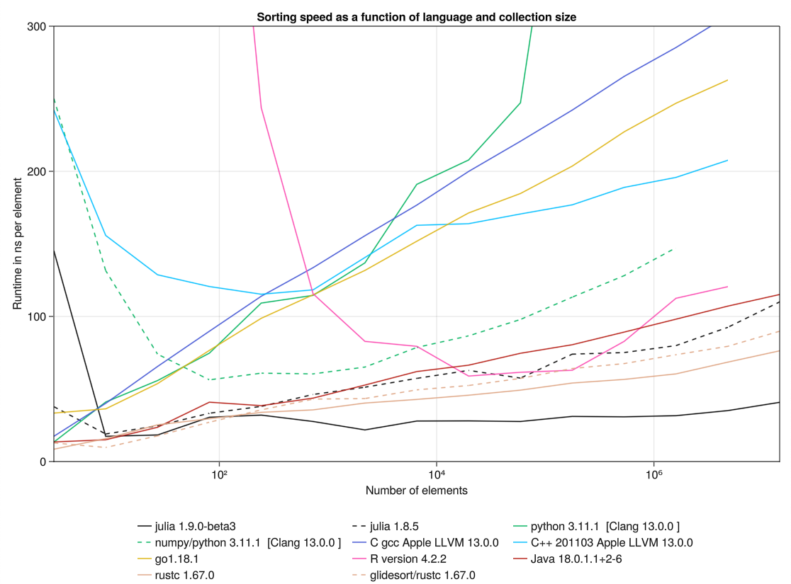

# Compare sorting speeds across languages

This repository benchmarks the same sorting dominated workload in several programming
languages.

Consider a vector $V$ of $n$ random numbers uniformly distributed between $0$ and $1$. What
is the expectation value of the dot product of $V$ and $1, 2, 3, \dots, n$? What if we sort
$V$ first? For each language, I implement a straightforward approximation algorithm for each
task. The first algorithm samples random vectors and computes dot products. The second is
the same with an additional sort operation between generation and dot product. Implementations are in [src](src).

I compute the difference between runtime with and without sorting to infer the sorting
runtime. For high performing languages on this benchmark, the vast majority of the time is
spent sorting (typically 80-90%).

I choose to use a sorting heavy workload rather than simpler microbenchmarks to increase
fairness across languages and benchmarking styles. By running each workload on the order of
a second, benchmarking artifacts are greatly reduced.

Some languages are given more numbers to sort than other languages, but these differences
are canceled by differences in speed resulting in a similar amount of processing time for
each implementation.

These result are from sorting vectors of 64 bit floating point numbers on a 2019
MacBook Air with a 1.6 GHz Dual-Core Intel Core i5 processor and 8 GB memory.

The notion of stability doesn't really make sense in the context of sorting IEEE floating
point numbers in ascending order except insofar as wheather or not NaN values with differing
payloads are reordered. That said, I classify the following entrants as "stable":
Julia, glidesort (but not Rust), Java, and Python (but not NumPy)

## Limitations

This benchmark, while more realisitc than many sorting bencharks, is still a microbenchmark,
and as such may contian benchmarking artifacts different than those found in production
code.

The benchmark covers only sorting of random floating point numbers into increasing order. 
See [SortMark.jl](https://github.com/LilithHafner/SortMark.jl) for a much more diverse set
of benchmarks for the Julia language specifically.

Each data point above is the result of a single trial. Lines would be smoother and more
reproducible if they were computed as a mean or median of three trials. Taking this to an
extreme, however, is likely to reintroduce benchmarking artifacts.
